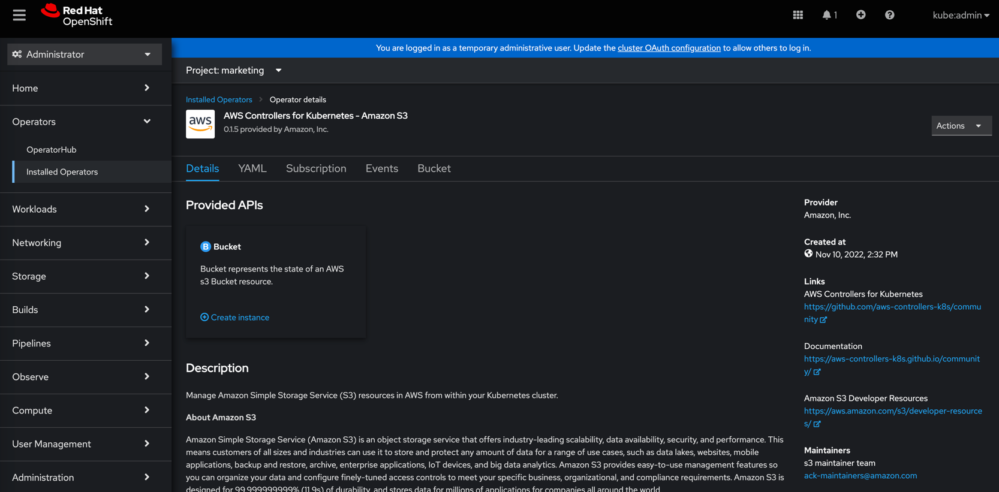
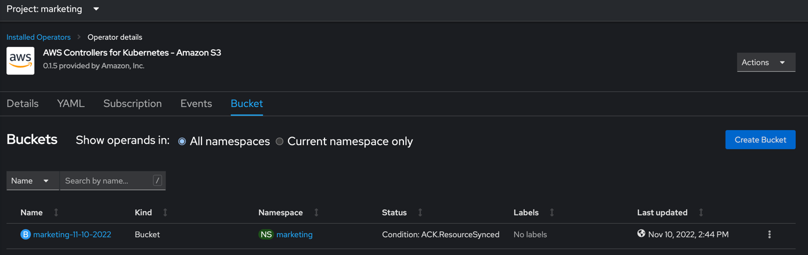

# Configuring/Leveraging AWS Controllers for Kubernetes (ACK) for Multi-tenancy Support in OpenShift

## By: Adam D. Cornett

## Overview
AWS Controllers for Kubernetes ("ACK") is an open source project that enables a user to define 
and use AWS resources directly from Kubernetes and OpenShift. Each supported AWS service has a controller that allows a 
user to manage the technology relevant to that service. For example, the S3 controller manages `Buckets`. This is very 
powerful tool to be able to manage AWS resources, directly from an OpenShift cluster, reducing time/effort to create AWS 
resources. 

ACK controllers are built with the flexibility to configure the controller to fit many IAM configurations. 
The controllers support Single-tenancy (one AWS account), Multi-tenancy (multiple AWS accounts), and even 
IAM roles for service accounts ([IRSA](https://docs.aws.amazon.com/eks/latest/userguide/iam-roles-for-service-accounts.html)) 
configuration out of the box. The most straightforward configuration is a Single-tenancy configuration, this would mean 
that any ACK resource created, an S3 bucket for example, would all be billed under the same AWS account, no matter the 
namespace that said bucket was created in. However, this configuration lacks the flexibility that is needed in most IT 
departments and organizations. In most IT departments and Enterprise organizations, each department or team has its own 
budget to keep track of, and ultimately its own AWS account where its resources are billed. In this article, we will configure
the ACK S3 Operator with multiple AWS accounts in an example Multi-tenant scenario. One account for the controller to run under,
and one account to create Buckets against, which the 'Marketing' department will get billed.

## Prerequisite
1. An OpenShift Cluster with Cluster Admin Access.
2. Two AWS Accounts.
   1. Two unique IAM IDs.
      1. One for the controller to run under.
      2. One account that will be billed for the buckets created.
3. AWS CLI (`$ aws`) installed.
4. OpenShift CLI (`$ oc`) installed.
5. The `$ tee` utility installed; used to save AWS CLI responses to disk.

## Creating IAM Users with Proper Permissions

### Step 1: Create a user in account `111111111111` and enable programmatic access
This is the account we provided to the ACK S3 controller, and will have no resources created in it.

Create the IAM User:
```bash
aws --profile 111111111111 iam create-user \
    --user-name ack-s3-service-controller \ 
    | tee created-user.json

# response, which is written to the file "create-user.json"
{
    "User": {
        "Path": "/",
        "UserName": "ack-s3-service-controller",
        "UserId": "AAAAAAAAAAAAAAAAAAAAA",
        "Arn": "arn:aws:iam::111111111111:user/ack-s3-service-controller",
        "CreateDate": "2022-11-08T20:24:56+00:00"
    }
}
```
More information about programmatic access can he found in [AWS Documentation](https://docs.aws.amazon.com/cli/latest/reference/iam/create-access-key.html).
**Note:** These credentials should be kept private.

Enable programmatic access:
```bash
aws --profile 111111111111 iam create-access-key \
    --user-name ack-s3-service-controller \
    | tee access-key.json

# response, which is written to the file "access-key.json"

{
    "AccessKey": {
        "UserName": "ack-s3-service-controller",
        "AccessKeyId": "00000000000000000000",
        "Status": "Active",
        "SecretAccessKey": "abcdefghIJKLMNOPQRSTUVWXYZabcefghijklMNO",
        "CreateDate": "2022-11-08T20:40:33+00:00"
    }
}
```

### Step 2: Create an 'assume role policy document' and create a role using this policy document.
This “assume role policy document” contains instructions as to what AWS principles can “assume” this role. 
To “assume” a role in AWS terms effectively means to have privileges enabled by that role.

Create user policy file on disk:
```bash
cat > user-policy.json <<EOF
{
    "Version": "2012-10-17",
    "Statement": [
        {
            "Effect": "Allow",
            "Action": [
                "iam:ListRoles",
                "sts:AssumeRole"
            ],
            "Resource": "*"
        }
    ]
}
EOF
```

Create the policy in AWS:
```bash
aws --profile 111111111111 iam create-policy \
    --policy-name ack-can-assume \
    --policy-document file://user-policy.json \
    | tee created-user-policy.json
```

Attach the policy to the user:
```bash
aws --profile 111111111111 iam attach-user-policy \
--user-name ack-s3-service-controller \
--policy-arn "arn:aws:iam::111111111111:policy/ack-can-assume"

#no output from this command, lets manually validate
aws --profile 111111111111 iam list-attached-user-policies \
    --user-name ack-s3-service-controller

{
    "AttachedPolicies": [
        {
            "PolicyName": "ack-can-assume",
            "PolicyArn": "arn:aws:iam::111111111111:policy/ack-can-assume"
        }
    ]
}
(END) 
```

### Step 3: Create a trust policy document and a role in account `222222222222`

Create trust policy file on disk:
```bash
cat > trust-policy.json <<EOF
{
    "Version": "2012-10-17",
    "Statement": {
        "Effect": "Allow",
        "Principal": {
            "AWS": "arn:aws:iam::111111111111:user/ack-s3-service-controller"
        },
        "Action": "sts:AssumeRole"
    }
}
EOF
``` 

Create the IAM Role:
```bash
aws --profile 222222222222 iam create-role \
    --role-name ack-marketing-s3 \
    --assume-role-policy-document file://trust-policy.json \
    | tee created-role.json

# response
{
    "Role": {
        "Path": "/",
        "RoleName": "ack-marketing-s3",
        "RoleId": "ABCDEFGHIJKLMNOPQRSTU",
        "Arn": "arn:aws:iam::222222222222:role/ack-marketing-s3",
        "CreateDate": "2022-11-08T21:35:59+00:00",
        "AssumeRolePolicyDocument": {
            "Version": "2012-10-17",
            "Statement": {
                "Effect": "Allow",
                "Principal": {
                    "AWS": "arn:aws:iam::111111111111:user/ack-s3-service-controller"
                },
                "Action": "sts:AssumeRole"
            }
        }
    }
}
```

Attach the policy to the role:
```bash
aws --profile 222222222222 iam attach-role-policy \
    --role-name ack-marketing-s3 \
    --policy-arn 'arn:aws:iam::aws:policy/AmazonS3FullAccess'
    
#no output from this command lets manually validate
aws --profile 222222222222 iam list-attached-role-policies \
    --role-name ack-marketing-s3

{
    "AttachedPolicies": [
        {
            "PolicyName": "AmazonS3FullAccess",
            "PolicyArn": "arn:aws:iam::aws:policy/AmazonS3FullAccess"
        }
    ]
}
(END) 
```

At this point we have configured a user `ack-s3-service-controller` in account `111111111111` that will be provided to the 
controller so that it can properly startup. This user has also been granted `AssumeRole` privileges for role 
`ack-marketing-s3` in account `222222222222`. We can now beging setting up the controller in the cluster.

## Configure the AWS S3 Controller so that it changes accounts based on namespaces

### Step 1: Create a new namespace that will be used to create buckets
This namespace will be used to create buckets, and will be tied to account `222222222222`, to make this a real world example, 
lets call this namespace `marketing`.

Create the namespace and annotate it:
```bash
oc new-project marketing 

# annotate the namespace
oc annotate namespace/marketing services.k8s.aws/owner-account-id=222222222222

# validate the annotation
oc annotate namespace/marketing --list
...ommited
services.k8s.aws/owner-account-id=222222222222
...ommited
```

### Step 2: Create the installation namespace
If the default `ack-system` namespace does not exist already, create it:
```bash
oc new-project ack-system
```

### Step 3: Create a `ConfigMap` 
This config map is a key value pair in the below format:
```bash
"awsaccountid": "role-arn-that-the-controller-can-assume"
```

```bash
oc create configmap \
  --namespace ack-system \
  --from-literal=222222222222=arn:aws:iam::222222222222:role/ack-marketing-s3 \
  ack-role-account-map
```

### Step 4: Configure the controllers credentials
These are the credentials that we created earlier in account `111111111111`.

Create a `config.txt` (NAMESPACE is intentionally blank so the controller will watch all namespaces):
```bash
cat <<EOF >>config.txt
ACK_ENABLE_DEVELOPMENT_LOGGING=true
ACK_LOG_LEVEL=debug
ACK_WATCH_NAMESPACE=
AWS_REGION=us-west-2
AWS_ENDPOINT_URL=
ACK_RESOURCE_TAGS=hellofromocp
EOF
```

Create the `ConfigMap` in the cluster:
```bash
export SERVICE=s3

oc create configmap \
--namespace ack-system \
--from-env-file=config.txt ack-$SERVICE-user-config
```

Create a `secrets.txt` file from the access-keys.json from earlier:
```bash
cat <<EOF >>secrets.txt
AWS_ACCESS_KEY_ID=00000000000000000000
AWS_SECRET_ACCESS_KEY=abcdefghIJKLMNOPQRSTUVWXYZabcefghijklMNO
EOF
```

Create the `Secret` in the cluster:
```bash
oc create secret generic \
--namespace ack-system \
--from-env-file=secrets.txt ack-$SERVICE-user-secrets
```

## **Note**
If you change the name of either the ConfigMap or the Secret from the values given above, i.e. ack-$SERVICE-user-config 
and ack-$SERVICE-user-secrets, then installations from OperatorHub will not function properly. The Deployment for the 
controller is preconfigured for these key values.

## Install the Operator via OperatorHub

Navigate to OperatorHub and search for `Amazon S3`:


Click Install:


Install the Operator with default settings:


Wait for the operator to install:


If all the previous steps were completed successful, the `View Operator` icon will appear:


## Create a `Bucket` in the `marketing` namespace

If the marketing namespace isn't already selected, click the dropdown by the project name:


Create a unique bucket name:


If we setup the accounts in AWS properly we should see `Condition: ACK.ResourceSynced` for the `Buckets` Status:


Validate that the bucket exists in the proper account:

Bucket should not exist in account `111111111111`:
```bash
aws --profile 111111111111 --region us-west-1 s3 ls | grep marketing
#no output
```

Bucket should exist in account `222222222222`:
```bash
aws --profile 222222222222 --region us-west-1 s3 ls | grep marketing
2022-11-14 08:44:24 marketing-11-10-2022
```

## Conclusion
If we followed all the instructions in this example, we have a controller running under one AWS IAM account, and then we 
were able to create a `Bucket` under another AWS IAM account. This simple example can be expanded to any number of 
namespaces, to accommodate any number of AWS IAM accounts that might exist in a real world IT organization.


## Further Reading
There have already been a few articles written about ACK. If you want to learn more about ACK within the OpenShift
ecosystem, recommend reading the follow articles.

- [Attention Developers: You can now easily integrate AWS services with your applications on OpenShift](
  https://cloud.redhat.com/blog/attention-developers-you-can-now-easily-integrate-aws-services-with-your-applications-on-openshift):
  High level overview of the project.
- [How to use Operators with AWS Controllers for Kubernetes](
  https://cloud.redhat.com/blog/attention-developers-you-can-now-easily-integrate-aws-services-with-your-applications-on-openshift):
  Pre-install steps for S3 Operator.
- [Create AWS resources with Kubernetes and Operators](
  https://developers.redhat.com/articles/2022/05/24/create-aws-resources-kubernetes-and-operators):
  Installing S3 Operator and creating a Bucket.
